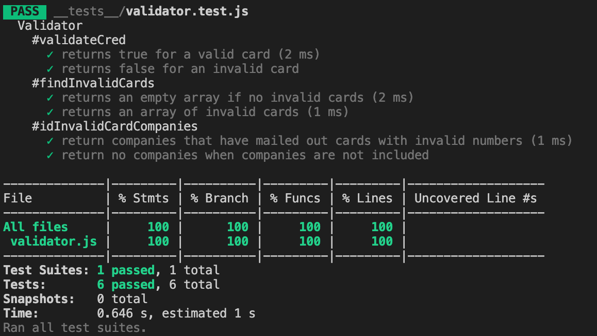

# Credit Card Validator

Tech test focusing on writing high-quality code, algorithmic understanding, and test driven development (TDD).

## Getting Started

### Development

Clone this repo.
To install dependencies:

```shell
npm install
```

Run test suites with:

```shell
npm test
```

For an interactive prompt that will allow you to experiment:

Run IRB:

```shell
node
```

Once in IRB:

```node
const Validator = require './src/validator.js'
validator = new Validator
```

### Usage

A demonstration of how to use the program.

```sh
> node './src/validator.rb'

> const Validator = require './src/validator.js'

> validator = new Validator

> const card1 = [4, 5, 3, 9, 6, 7, 7, 9, 0, 8, 0, 1, 6, 8, 0, 8]

> const card2 = [4, 5, 3, 2, 7, 7, 8, 7, 7, 1, 0, 9, 1, 7, 9, 5]

> const batch = [card1, card2]

> validator.validateCred(card1)
true

> validator.findInvalidCards(batch)
[card2]

> validator.idInvalidCardCompanies(batch)
['Visa']
```

## Spec

### Context

The company that you work for suspects that credit card distributors have been mailing out cards that have invalid numbers. In this test, you have the role of a clerk who checks if credit cards are valid. Every other clerk currently checks using pencil and paper, but you’ll be optimizing the verification process using your knowledge of JavaScript to handle multiple credit cards at a time.

The problem can be solved by using Luhn algorithm.

Luhn check or the Mod 10 check, which can be described as follows (for illustration,
consider the card number 4388576018402626):

> - Step 1. Double every second digit from right to left. If doubling of a digit results in a
>   two-digit number, add up the two digits to get a single-digit number (like for 12:1+2, 18=1+8).
> - Step 2. Now add all single-digit numbers from Step 1.
>   4 + 4 + 8 + 2 + 3 + 1 + 7 + 8 = 37
> - Step 3. Add all digits in the odd places from right to left in the card number.
>   6 + 6 + 0 + 8 + 0 + 7 + 8 + 3 = 38
> - Step 4. Sum the results from Step 2 and Step 3.
>   37 + 38 = 75
> - Step 5. If the result from Step 4 is divisible by 10, the card number is valid; otherwise, it is invalid.

### Requirements

- To return true when an array contains digits of a valid credit card number and false when it is invalid. This should NOT mutate the values of the original array.
- To check through the nested array for which numbers are invalid, and return another nested array of invalid cards.
- To check through the nested array of invalid numbers and returns an array of companies.
  Currently, there 4 accepted companies which each have unique first digits. The following table shows which digit is unique to which company:

| First Digit | Company                 |
| ----------- | ----------------------- |
| 3           | Amex (American Express) |
| 4           | Visa                    |
| 5           | Mastercard              |
| 6           | Discover                |

If the number doesn’t start with any of the numbers listed, print out a message like: “Company not found”.

- Return an array of companies that have mailed out cards with invalid numbers. This array should NOT contain duplicates, i.e. even if there are two invalid Visa cards, "Visa" should only appear once in the array.

## Test Coverage



## Plan

### User Stories

```
As a clerk,
To prevent the distribution of fraudulent cards,
I would like to identify the validity of a card.
```

```
As a clerk,
To record the illegitimate cards,
I would like to view all invalid cards.
```

```
As a clerk,
To identify the credit card companies that have possibly issued these faulty numbers,
I would like to view the companies associated to the invalid cards.
```
